# Introduction to Configuration Management in Kubernetes with Kustomize

> This project is designed to introduce Kubernetes configuration management using **Kustomize**. I will customize, build, and manage Kubernetes resources declaratively using Kustomize in a local Kubernetes cluster powered by Minikube.

----

## Technologies & Tools Used

- **Kubernetes**
- **Kustomize**
- **Docker Desktop**
- **Minikube**
- **kubectl (Kubernetes CLI)**
- **Visual Studio Code (VS Code)**
- **YAML & Kubernetes Extensions for VS Code**
- **Github account (Optional)**

----
#  Setup Instructions

## 1. **Install Required Tools**
```
- [Docker Desktop](https://www.docker.com/products/docker-desktop/)
- [kubectl](https://kubernetes.io/docs/tasks/tools/install-kubectl-windows/)
- [Minikube](https://minikube.sigs.k8s.io/docs/start/)
- [Kustomize](https://kubectl.docs.kubernetes.io/installation/kustomize/)
- [Visual Studio Code](https://code.visualstudio.com/)
```

## Verify Installations
```
code --version
docker --version
kubectl version --client
minikube version
kustomize version
git --version
```


---


## 2: Create Project Structure
```
kustomize-demo/
│
├── base/
│   ├── kustomization.yaml 
|   ├── mydeployment.yaml
│   └── mypod.yaml
│
├── overlays/
│   ├── dev/
│   │   ├── kustomization.yaml
│   │   └── patch.yaml
│   │
│   └── prod/
│       ├── kustomization.yaml
│       └── patch.yaml
```

```
mkdir kustomize-demo
cd kustomize-demo
```


### Start Minikube with Docker Driver:
```
minikube start --driver=docker
```

### Check Tiny Kubernetes Cluster:
```
kubectl get nodes
```

### Check Minikube Status:
```
minikube status
```


----


## 3: Understanding Kubernetes Configuration

- Key Concepts:
- Pods are the smallest deployable units, Deployments manage replicas, Services expose Pods, and ConfigMaps store configuration data.


## Create a Kubenertes file named mypod.yaml:
```
touch mypod.yaml
```
- **Paste**
```
apiVersion: v1
kind: Pod
metadata:
  name: mypod
spec:
  containers:
  - name: mycontainer
    image: nginx
```

**Explanation:** This YAML defines a Pod named mypod running an NGINX container.

----

## 4: Apply Pod to Kubernetes:

- Apply Pod to the mini-cluster:
```
kubectl apply -f mypod.yaml
```

### Check if the Pod is running:
```
kubectl get pods
```


## Introduction to Kustomize

- #### Key Points:
- Kustomize enables declarative configuration management.
- It supports overlays for environment-specific customizations (e.g., dev, prod).
- It’s integrated with kubectl (no separate tool needed for basic use).


## Experiment with Kustomize:

#### Install Kustomize and set up a basic Kubernetes cluster using minikube

- Create a kustomization.yaml file in your project directory:
```
touch kustomization.yaml
```

**Paste**
```
apiVersion: kustomize.config.k8s.io/v1beta1
kind: Kustomization
resources:
- mypod.yaml
```

## Run Kustomize to preview the output:
```
kustomize build .
```

## Verify the Pod:
```
kubectl get pods
```


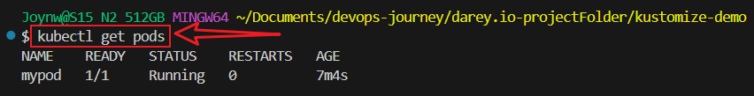


**Explanation:** This kustomization.yaml references mypod.yaml and generates the combined configuration.


###  Experiment with Kustomize features, 

- Add label to pod, modify kustomization.yaml to include a commonLabels field:

```
commonLabels:
  app: nginx
```

### Run

```
kustomize build .
```

### Apply the updated configuration:
```
kubectl apply -k .
```

### Verify the label
```
kubectl get pods --show-labels
```


**Note:** Kustomize allows us to customize configurations (e.g., adding labels, changing images) without modifying the base YAML files, which is useful for managing multiple environments.


- ## Add a patch to change the nginx image tag, demonstrating Kustomize’s customization capabilities.

- #### Update kustomization.yaml
```
patches:
- path: patch.yaml
```


#### Create patch.yaml:
```
touch patch.yaml
```
```
cat > patch.yaml <<EOF
apiVersion: v1
kind: Pod
metadata:
  name: mypod
spec:
  containers:
  - name: mycontainer
    image: nginx:1.19
```

### Build, Apply and Verify:
```
kustomize build .
kubectl apply -k .
kubectl describe pod mypod | grep Image
```
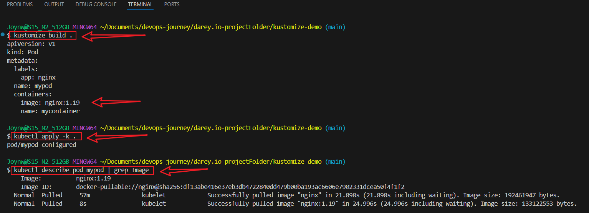


### Version Control with GitHub:

- Create a repositoy on github

#### Initialize the Git repository:
```
git init
git add .
git commit -m "Initial Kustomize project"
```

#### Push to a new GitHub repository
```
git branch -m master main
git remote add origin https://github.com/yourusername/your-repository.git
git push -u origin main
```


## Create Overlays

- Manage environment-specific configurations (dev, prod).

- Create structure:
```
mkdir -p base overlays/dev overlays/prod
mv mypod.yaml kustomization.yaml patch.yaml base/
```


## Update base/kustomization.yaml
```
apiVersion: kustomize.config.k8s.io/v1beta1
kind: Kustomization
resources:
- mypod.yaml
```

**Note: move patch.yaml to overlay for now**

### Create overlays/dev/kustomization.yaml
```
cat > overlays/dev/patch.yaml <<EOF
apiVersion: v1
kind: Pod
metadata:
  name: mypod
spec:
  containers:
  - name: mycontainer
    image: nginx:1.19
EOF
```

**Check**
```
cat overlays/dev/patch.yaml
```

## Create overlays/dev/kustomization.yaml
```
cat > overlays/dev/kustomization.yaml <<EOF
apiVersion: kustomize.config.k8s.io/v1beta1
kind: Kustomization
bases:
- ../../base
patches:
- path: patch.yaml
labels:
- includeSelectors: true
  pairs:
    env: dev
EOF
```

**Verify**
```
cat overlays/dev/kustomization.yaml
```


## Check overlays/prod/patch.yaml
```
cat > overlays/prod/patch.yaml <<EOF
apiVersion: v1
kind: Pod
metadata:
  name: mypod
spec:
  containers:
  - name: mycontainer
    image: nginx:1.21
EOF
```

**Verify**
```
cat overlays/prod/patch.yaml
```


### Create overlays/prod/kustomization.yaml
```
cat > overlays/prod/kustomization.yaml <<EOF
apiVersion: kustomize.config.k8s.io/v1beta1
kind: Kustomization
bases:
- ../../base
patches:
- path: patch.yaml
labels:
- includeSelectors: true
  pairs:
    env: prod
EOF
```

### Test the Overlays

- Build **dev and prod**  Configuration:
```
cd overlays/dev
kustomize build .
cd ../prod/
kustomize build .
```
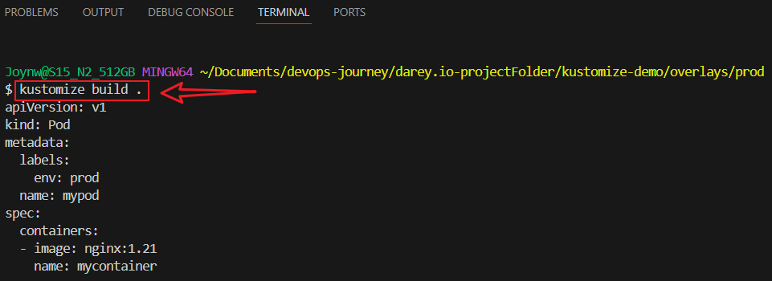


#### Apply dev to Minikube: Ensure Minikube is running:
```
cd kustomize-demo
kubectl apply -k overlays/dev
```

**Verify**
```
kubectl get pods --show-labels
```
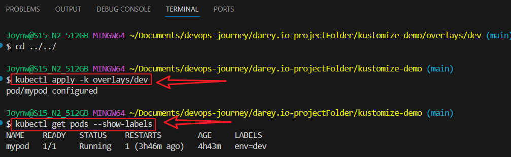


### Apply prod and Verify
```
kubectl apply -k overlays/prod
kubectl get pods --show-labels
```
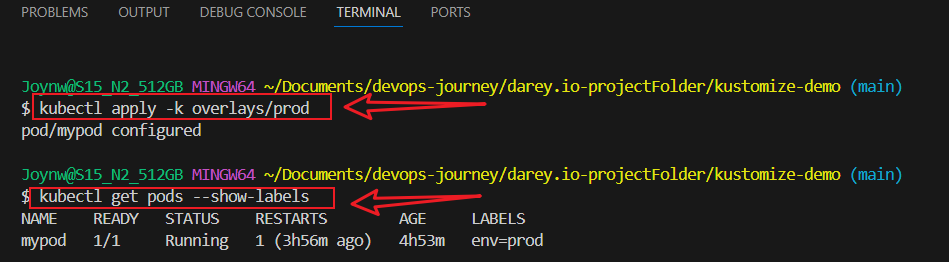


### Verify Both Overlays
- Switch Back to dev
```
kubectl apply -k overlays/dev
kubectl get pods --show-labels
```

### Check Pod Details
```
kubectl describe pod mypod
```


### Check current log:
```
kubectl logs mypod
```

### Check realtime log:
```
kubectl logs mypod -f
kubectl logs mypod -f --since=10m --tail=500
```


### Monitor Pod:
```
kubectl get pods --watch

```
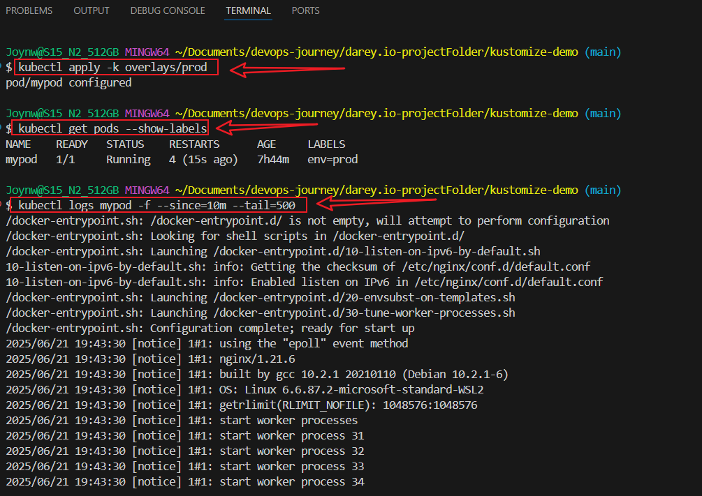
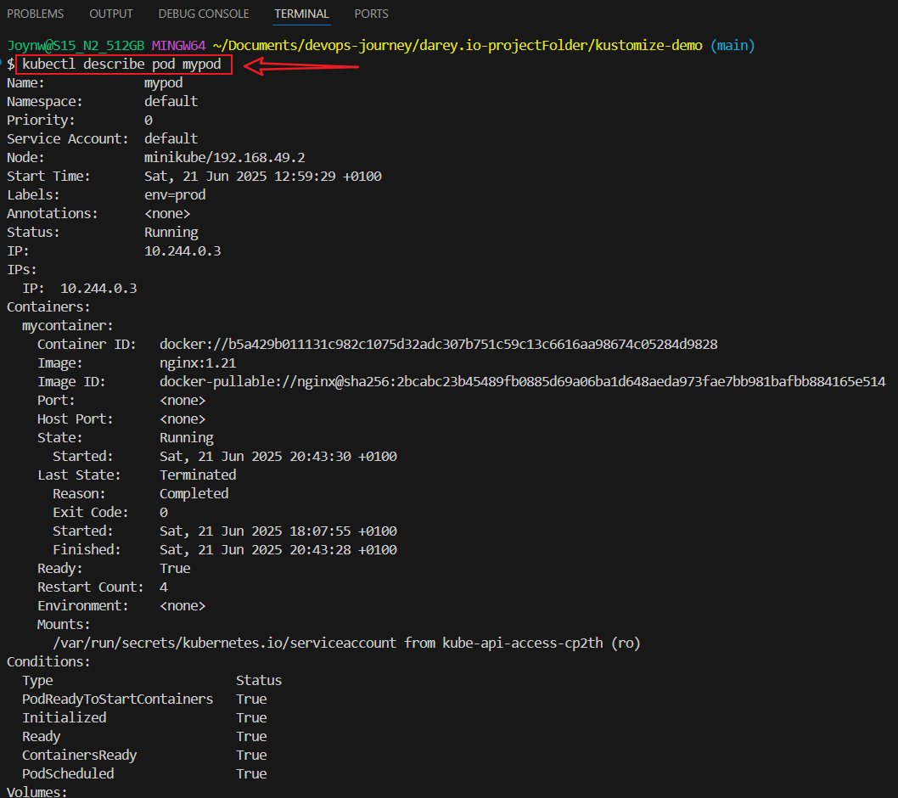
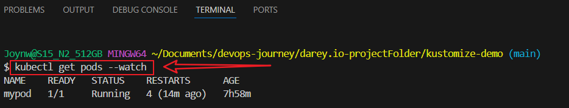


### Commit Changes
### Stage and Commit:

```
git add .
git commit -m "Tested log files"
git push 
```

## Explore Deployments: Add a mydeployment.yaml to base
```
cat > base/mydeployment.yaml <<EOF
apiVersion: apps/v1
kind: Deployment
metadata:
  name: mydeployment
spec:
  replicas: 3
  selector:
    matchLabels:
      app: nginx
  template:
    metadata:
      labels:
        app: nginx
    spec:
      containers:
      - name: mycontainer
        image: nginx
EOF
```

**Verify**
```
cat base/mydeployment.yaml
```


## Update base/kustomization.yaml:
```
cat > base/kustomization.yaml <<EOF
apiVersion: kustomize.config.k8s.io/v1beta1
kind: Kustomization
resources:
- mypod.yaml
- mydeployment.yaml
EOF
```

### Verify
```
cat base/kustomization.yaml
```


### Update under spec.template.spec.containers:
```
containers:
- name: mycontainer
  image: nginx:1.21
```

### overlays/prod/patch.yaml

**Add**
```
        resources:
          limits:
            cpu: "0.5"
            memory: "512Mi"
          requests:
            cpu: "0.2"
            memory: "256Mi"
EOF
```


### Run
```
kubectl apply -k overlays/prod
kubectl get pods --show-labels
kubectl logs mypod -f --since=35m --tail=500
kubectl describe pod mydeployment-76f675b7b6-88lnl
```
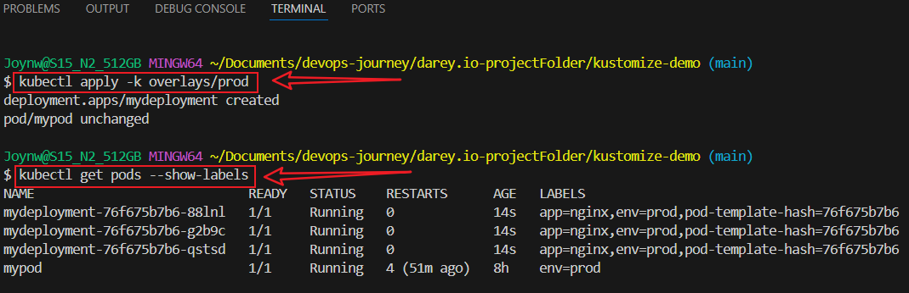


### Confirm Consistency
#### Check mydeployment Image:

- Ensure the Deployment uses the intended version (1.21 to match mypod)
```
kubectl edit -f base/mydeployment.yaml
```
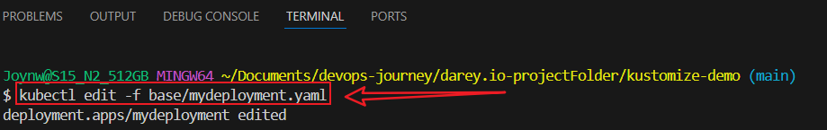


**Reapply:**
```
kubectl apply -k overlays/prod
```

### Monitor Logs:
Continue monitoring mypod and mydeployment:
```
kubectl logs mypod -f --since=1h --tail=500
kubectl logs mydeployment-76f675b7b6-88lnl -f --since=35m --tail=500
```


**Run**
```
kubectl delete pod mypod
kubectl get pods --show-labels
```
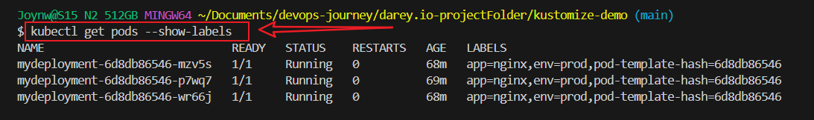


### Stop and Delete Minikube:

```
minikube stop 
minikube delete
```


## Conclusion
This project demonstrates a practical use of Kubernetes' Kustomize for managing environment-specific configurations in a scalable and maintainable way. By leveraging Minikube, Docker, and Kubernetes manifests, I successfully deployed and customized an Nginx pod across different environments. This setup ensures consistency, flexibility, and ease of updates, making it suitable for real-world production and development workflows.


### References

- Kubernetes Official Docs

- Kustomize GitHub Repository

- Minikube Documentation

- kubectl Overview


### Author
### Joy Nwatuzor
