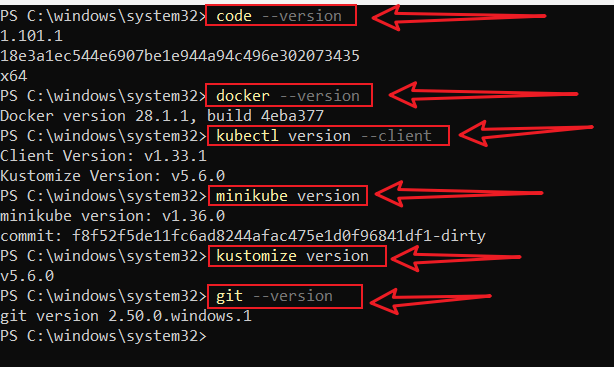
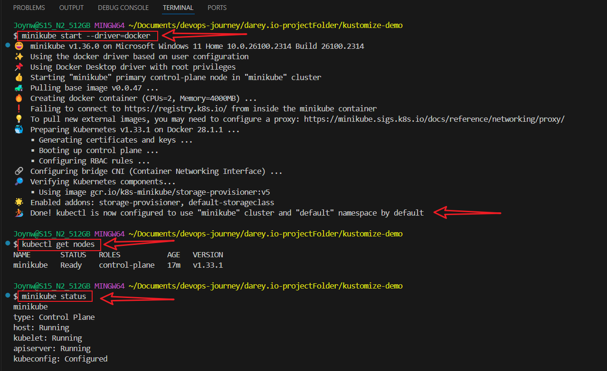
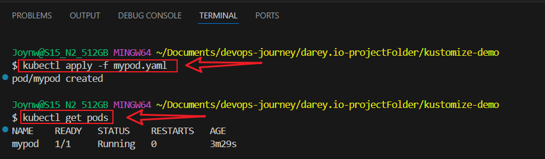
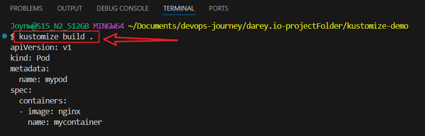
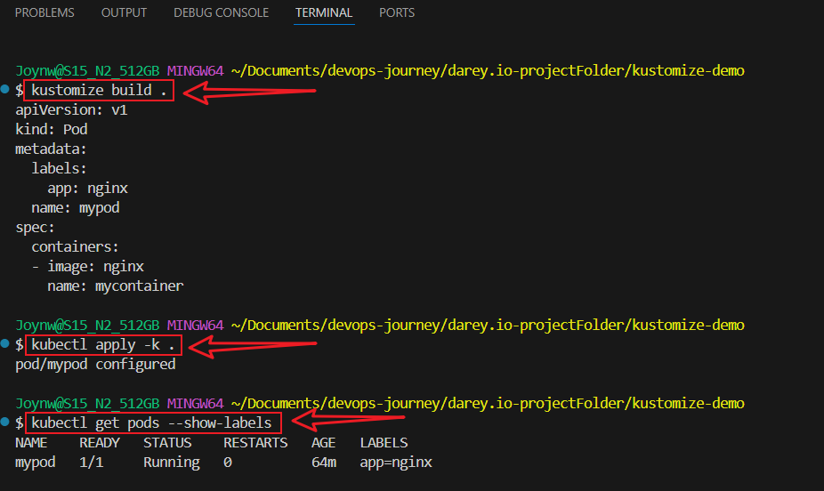
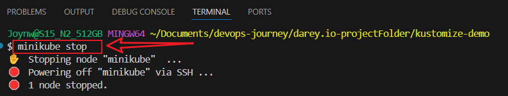
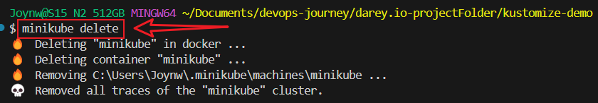

# Introduction to Configuration Management in Kubernetes with Kustomize

> This project is designed to introduce Kubernetes configuration management using **Kustomize**. I will customize, build, and manage Kubernetes resources declaratively using Kustomize in a local Kubernetes cluster powered by Minikube.

----

## Technologies & Tools Used

- **Kubernetes**
- **Kustomize**
- **Docker Desktop**
- **Minikube**
- **kubectl (Kubernetes CLI)**
- **Visual Studio Code (VS Code)**
- **YAML & Kubernetes Extensions for VS Code**
- **Github account (Optional)**

----
#  Setup Instructions

## 1. **Install Required Tools**
```
- [Docker Desktop](https://www.docker.com/products/docker-desktop/)
- [kubectl](https://kubernetes.io/docs/tasks/tools/install-kubectl-windows/)
- [Minikube](https://minikube.sigs.k8s.io/docs/start/)
- [Kustomize](https://kubectl.docs.kubernetes.io/installation/kustomize/)
- [Visual Studio Code](https://code.visualstudio.com/)
```

## Verify Installations
```
code --version
docker --version
kubectl version --client
minikube version
kustomize version
git --version
```



---


## 2: Create Project Structure

kustomize-demo/
│
├── kustomization.yaml       
└── mypod.yaml 


```
mkdir kustomize-demo
cd kustomize-demo
```


### Start Minikube with Docker Driver:
```
minikube start --driver=docker
```

### Check Tiny Kubernetes Cluster:
```
kubectl get nodes
```

### Check Minikube Status:
```
minikube status
```



----


## 3: Understanding Kubernetes Configuration

- Key Concepts:
- Pods are the smallest deployable units, Deployments manage replicas, Services expose Pods, and ConfigMaps store configuration data.


## Create a Kubenertes file named mypod.yaml:
```
touch mypod.yaml
```
- **Paste**
```
apiVersion: v1
kind: Pod
metadata:
  name: mypod
spec:
  containers:
  - name: mycontainer
    image: nginx
```

**Explanation:** This YAML defines a Pod named mypod running an NGINX container.

----

## 4: Apply Pod to Kubernetes:

- Apply your Pod to the mini-cluster:
```
kubectl apply -f mypod.yaml
```

### Check if the Pod is running:
```
kubectl get pods
```



## Introduction to Kustomize

- #### Key Points:
- Kustomize enables declarative configuration management.
- It supports overlays for environment-specific customizations (e.g., dev, prod).
- It’s integrated with kubectl (no separate tool needed for basic use).


## Experiment with Kustomize:

#### Install Kustomize and set up a basic Kubernetes cluster using minikube

- Create a kustomization.yaml file in your project directory:
```
touch kustomization.yaml
```

**Paste**
```
apiVersion: kustomize.config.k8s.io/v1beta1
kind: Kustomization
resources:
- mypod.yaml
```

## Run Kustomize to preview the output:
```
kustomize build .
```



**Explanation:** This kustomization.yaml references mypod.yaml and generates the combined configuration.


###  Experiment with Kustomize features, such as adding a label to your Pod using Kustomize.

- Modify kustomization.yaml to include a commonLabels field:

```
apiVersion: kustomize.config.k8s.io/v1beta1
kind: Kustomization
resources:
- mypod.yaml
commonLabels:
  app: nginx
```

### Run

```
kustomize build .
```


**Note:** Kustomize allows us to customize configurations (e.g., adding labels, changing images) without modifying the base YAML files, which is useful for managing multiple environments.


## Stop and Delete Minikube
```
minikube stop 
minikube delete
```




### Version Control with GitHub:

- Create a repositoy on github

#### Initialize the Git repository:
```
git init
git add .
git commit -m "Initial Kustomize project"
```

#### Push to a new GitHub repository
```
git branch -m master main
git remote add origin https://github.com/yourusername/your-repository.git
git push -u origin main
```


### References

- Kubernetes Official Docs

- Kustomize GitHub Repository

- Minikube Documentation

- kubectl Overview


### Author
### Joy Nwatuzor
